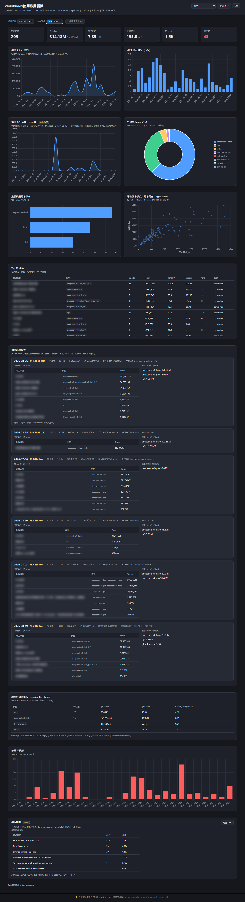
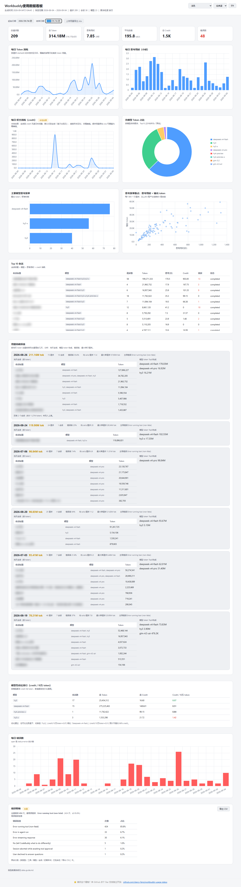

> **Skill Overview**
>
> WorkBuddy Usage Status turns WorkBuddy's own local usage data into an offline, auditable dashboard — token spend, thinking time, thinking efficiency, model distribution, error count, and credit consumption. It ranks model cost-performance (credit per 1k tokens) with switching suggestions so you can pick the cheapest model, and now supports a date-range filter so you can zoom into any period. All model-share charts are limited to the top 10 models with the rest grouped as "Other". All data stays on your machine under `~/.workbuddy/`; **default zero network, no external APIs**. The generated dashboard is a single self-contained HTML file (Chart.js inlined), so it renders anywhere with zero dependencies. An optional **opt-in** mode can pull precise credit from WorkBuddy's official usage API using a token you manually export from your own browser (never auto-read from the host App) — see §6 known limits.
>
> **What it does**: Offline dashboard for WorkBuddy's local usage data — token / credit consumption, thinking efficiency, model distribution & cost-performance, date-range filtering, error monitoring, and usage-spike analysis. Purely local **by default**, zero network dependency; an optional opt-in flag can fetch precise credit via the official usage API with a user-supplied token (disabled by default, never auto-reads host credentials).
>
> **Recent updates**:
>
> - **Color scheme selection** — switch between Light / Dark / system-following themes, plus several icon palettes.
> - **Detailed credit analysis (xlsx)** — import a usage-export xlsx for precise per-day and per-model credit breakdowns.
>
> **How to install**
>
> ```
> clawhub install workbuddy-usage-status
> ```
>
> **How to use**
>
> - **Chat trigger (natural language):** Describe what you want in plain English or Chinese — WorkBuddy detects this skill by *meaning*, not a fixed keyword list. Anything expressing *viewing, generating, or exporting your WorkBuddy usage status / stats / activity dashboard* will trigger it. Examples:
>
>   "generate a WorkBuddy usage dashboard" · "view my recent WorkBuddy usage status" · "show token / credit consumption and model distribution" · "which model is the most cost-effective" · "filter usage by date range" · "which day had the highest usage"
>
>   Scope is limited to WorkBuddy's own local usage data.
> - **CLI:** `python3 scripts/usage_extractor.py` (options: `--out ./report`, `--home /other/.workbuddy`). Python 3.10+, standard library only. Windows users please replace `python3` with `python`.
>
> ⭐ If this dashboard helped you see your WorkBuddy usage clearly, please give it a Star to support independent development: [github.com/clancy-feng/workbuddy-usage-status](https://github.com/clancy-feng/workbuddy-usage-status)
>
> The full Chinese documentation is preserved below.

---

把 WorkBuddy 自己的本地使用数据，变成一份离线可查的 Dashboard。

可以看到：token 消耗、思考用时、思考效率、模型分布、错误数、credit 消耗。

## 📸 看板预览

> 以下为 Dashboard 实际渲染效果（图片为仓库相对路径，在 Gitee / GitHub 页面与本地均可直接显示）：





## ✨ 核心功能特性

- Token/Credit 全链路可视化：按模型、按日期、按会话统计，一眼定位"烧钱大户"
- 用量高峰探查：自动按 credit 排序列出最高的几天，逐日拆解主导会话、模型 token 构成、错误率、最大单次请求——精确到"哪一天花了多少"，帮你快速定位消耗集中日
- 思考效率量化：输出 token ÷ 思考秒数（tok/s），横向对比模型性价比
- 错误集中监控：快速定位报错频繁的会话/模型，降低调试成本，可导出错误详情。
- 离线运行：Chart.js 已内联，单文件 HTML 双击即看
- 只读无侵入：以只读模式访问 WorkBuddy 数据，不影响正在运行的程序
- 跨平台兼容：支持 Windows/macOS/Linux，Python 3.10+ 即可运行

---

## 1. 能看到什么

- 从开始用WorkBuddy到现在一共花了多少 token / credit？思考了多久？
- 哪个会话、哪个模型消耗最大？模型效率怎么样？
- 哪天用量飙升？错误集中在哪些会话/模型？
- 用作"使用监督 / 用量控制"的量化依据。

---

## 2. 如何安装

> 💡 安装引导：国内用户优先选 SkillHub 一键安装，全球用户/OpenClaw 生态用户优先选 ClawHub 安装。

### 方式一：通过 WorkBuddy 对话安装

把 SkillHub 提供的以下提示词发给WorkBuddy：

请根据 <https://skillhub.cn/install/skillhub.md> 安装workbuddy-usage-status。

### 方式二：通过 ClawHub 安装

```
clawhub install workbuddy-usage-status
```

### 方式三：本地手动安装

```
git clone https://gitee.com/beclancy/workbuddy-usage-status.git ~/.workbuddy/skills/workbuddy-usage-status
```

---

## 3. 用法

装好 skill并重启 WorkBuddy 后，有两种用法。

### 入口 A：对话触发

在 WorkBuddy 对话里用自然语言描述你的需求即可，skill 会根据语义自动识别并引导生成看板。例如：

- "生成一个 WorkBuddy 使用信息看板"
- "查看一下最近 WorkBuddy 的使用状态"
- "我想看看 WorkBuddy 的工作信息看板，包括 token 消耗和模型分布"
- "看一下 Workbuddy 的使用数据"

### 入口 B：命令行直接跑

在任意目录执行（Python 3.10+，仅标准库）：

```
# 生成到当前目录（默认）
python3 scripts/usage_extractor.py

# 生成到指定目录
python3 scripts/usage_extractor.py --out ./report

# 指定数据根（一般不用，默认 ~/.workbuddy）
python3 scripts/usage_extractor.py --home /other/.workbuddy

# 可选：用用量导出 xlsx 精确覆盖对应日期窗口的 credit
# xlsx 来自 workbuddy.cn 用量页 → 选日期范围 → 导出；最多 1 个月
python3 scripts/usage_extractor.py --credit-xlsx ~/Downloads/request-usage-2026-08-10.xlsx

# 可选（手动token注入）：直接调用官方用量 API 拉取精确 credit，无需先导出 xlsx
# token 文件内容：从浏览器 DevTools 复制的鉴权头（如 `Cookie: ...` 整行，或 `Authorization: Bearer ...`）
python3 scripts/usage_extractor.py --billing-token-file ~/Desktop/workbuddy-auth.txt
```

Windows 用户请将上述命令中的 `python3` 替换为 `python`。

### 看结果

脚本在「输出目录」（即你运行命令时所在目录，或 `--out` 指定的目录）生成 3 个文件：

| 文件                                            | 说明                                                         |
| --------------------------------------------- | ---------------------------------------------------------- |
| `workbuddy-usage-status-dashboard-<时间戳>.html` | 生成的报告文件，数据 + Chart.js 均已内联，双击即看；文件名带生成时间戳，每次生成独立文件，可保留多份对比 |
| `usage-status.json`                           | 聚合后的原始数据，可二次处理                                             |
| `usage-status.js`                             | `window.USAGE_STATUS = {...}`，备用                           |

打开最新生成的 `workbuddy-usage-status-dashboard-*.html` 即可看到：KPI 卡 + 每日积分消耗（credit）图 + 每日思考用时图 + 各模型 Token 占比 + 模型效率 + 效率散点 + Top 10 Token消耗会话表 + 每日错误。四张时序图的横轴会按所选日期范围的跨度自动在「日 / 周 / 月」之间切换（≤120 天按日，120–730 天按周，>730 天按月），日期选择在修改起止日期后看板立即刷新。


### 精确化 credit（可选）

> 本地 `credit_json` 没有逐日时间戳，看板默认按「归首日」把会话 credit 归因到它首次出现的那天（详见 DATA-GUIDE.md §2.2 / §8.5），这是估算值。以下两种可选用法都能用**服务端精确值**覆盖对应日期窗口的每日 credit。

#### 用法一：用量导出 xlsx（--credit-xlsx）

从 WorkBuddy 官方用量页导出 xlsx，用其中的服务端精确 credit 覆盖对应日期窗口：

1. 打开 `https://www.workbuddy.cn/profile/plans-usage`（用量明细表）。
2. 选日期范围（最多 1 个月），点导出，得到 xlsx。
3. 运行：`python usage_extractor.py --credit-xlsx 路径/xxx.xlsx`

**覆盖逻辑**

- 读取 xlsx 中每条请求的 `积分消耗` + `时间`，按天汇总成精确每日 credit。
- 用这些精确值覆盖本地数据中对应日期的 `by_day[day].credit`；看板该卡片与 KPI 标注「精确（用量导出）」。
- 未覆盖日期仍为本地「归首日」估算（标注「本地估算」）。

**边界与限制**

- 只覆盖 1 个月：导出上限如此，长期趋势仍以 token 为准。
- 只能到"天"，不能到"会话"：xlsx 无 sessionId / traceId，无法把精确 credit 归因到具体会话；模型性价比排行仍用本地会话级 credit（估算）。
- 若 xlsx 与本地数据无日期重叠，credit 维持本地估算，并在结尾提示。

#### 用法二：看板内联上传

除命令行外，看板顶部筛选栏新增「上传用量导出 xlsx」按钮，可直接在浏览器里选文件，**效果与 `--credit-xlsx` 完全一致**：

- 点击按钮 → 选 xlsx → 看板用浏览器原生 API **离线**解析，解析后自动更新日期区间显示结果。
- 按 `时间`/`time` 取日、`积分消耗`/`credit` 按日累加，覆盖 `by_day[day].credit`，徽标变「精确（用量导出）」，每日 credit 曲线与提示实时更新。
- 解析失败（非 xlsx / 缺必要列 / 无重叠日期）会在按钮旁红字提示，`credit_source` 保持 `local_estimate`，不会污染既有数据。
- 两种导入方式都能把「每天的 credit」算精确，也都会生成「各模型精确性价比」对比表（看清哪个模型最划算）：看板上传会在浏览器里借同一日期窗口内的本地 trace token 数做配平，口径与命令行 `--credit-xlsx` 完全一致。

#### 用法三：官方用量 API（--billing-token-file，手动加载 token）

> **定位**：用法一（`--credit-xlsx`）的"免导出版"——效果相同，但无需先去用量页导出 xlsx，需要用户手动从浏览器复制一份鉴权头。
>
> **安全总原则**：token 由用户**显式提供**，该能力**默认关闭**，仅当用户主动传入 `--billing-token-file` 时才联网一次。

WorkBuddy 的用量数据来自官方计费 API：

```
POST https://www.workbuddy.cn/billing/meter/get-user-request-usage
Body: {"startTime":"YYYY-MM-DD 00:00:00","endTime":"YYYY-MM-DD 23:59:59","pageNum":1,"pageSize":3000}
```

登录了 WorkBuddy，浏览器/App 就会在请求里带上该会话凭据，**这条凭据只存在于你已登录的浏览器/App 会话里。**

**用户手动导出步骤（4 步，全程在你自己浏览器里完成）**：

1. 在**你已登录 WorkBuddy** 的浏览器里打开用量页：<https://www.workbuddy.cn/profile/plans-usage>。
2. 按 `F12` 打开开发者工具 → 切到 **Network（网络）** 标签。
3. 在页面上触发一次用量数据加载（刷新页面、或切一下日期范围），在网络列表里找到那条

   `get-user-request-usage` 请求 → 右键 → **Copy → Copy request headers（复制请求头）**，或单独复制它的 `Cookie:` / `Authorization:` 那一行完整内容。
4. 把复制到的内容粘贴进一个**本地纯文本文件**（如 `~/Desktop/workbuddy-auth.txt`）。

   文件里可以是：
   - 一整行 `Cookie: sessionId=xxx; xxx=yyy`（最常见）；或
   - 一整行 `Authorization: Bearer xxxx`；或
   - 直接就是 cookie 的值（不带 `Cookie:` 前缀也行，skill 会当作 Cookie 值处理）。

> ⚠️ 这个文件等同于你的会话凭证，**请把它当密码对待**，用完可在 workbuddy.cn 退出登录让它失效。

**怎么用**

```bash
# 在 skill 目录下（Windows 把 python3 换成 python）
python3 scripts/usage_extractor.py --billing-token-file ~/Desktop/workbuddy-auth.txt
```

- 同时传 `--credit-xlsx` 和 `--billing-token-file` 的话 → **API 优先**（都用精确值，API 覆盖 xlsx）。
- 请求窗口：自动取本地数据的最小/最大日期（无则默认最近 30 天 ~ 今天）。

**覆盖逻辑（与 --credit-xlsx 同口径，仅数据源不同）**

- 调用官方 API 拿回逐请求明细（每条含 `requestTime`、`credit`、`model` 等），按天汇总成精确每日 credit。
- 用精确值覆盖本地数据中对应日期的 `by_day[day].credit`；看板该卡片与 KPI 标注「精确（用量 API）」。
- 同时按模型汇总**服务端精确 credit**（逐请求口径），修正本地"整会话 credit 归因到单一模型"的虚高问题；模型性价比排行据此更准确。
- 把 API 实际覆盖的日期窗口（`billing_date_min/max`）写入 `summary`；看板默认选中范围自动收敛到该窗口，聚焦 credit 精确的区间。
- 若 API 返回空 / token 失效 / 网络失败 → **优雅回退**本地估算。

## 4. 报告刷新

数据是静态快照，想更新就再跑一次脚本，重新打开 HTML：

```
python3 scripts/usage_extractor.py --out ./report
```

如想每天自动刷新，可用 WorkBuddy 的"自动化/定时任务"每天跑这条命令。

---

## 5. 指标来源及算法（详见 DATA-GUIDE.md）

| 指标        | 算法                                                                | 数据来源                        |
| --------- | ----------------------------------------------------------------- | --------------------------- |
| 思考用时      | 每条 trace 里 `type=generation` 的 span 时长之和                          | `traces/*/trace_*.json`     |
| 思考效率      | 输出 token ÷ 思考秒数（tok/s）                                            | `traces/*/trace_*.json`     |
| token 消耗  | `totalTokens`（输入+输出+缓存）按会话/模型/天聚合                                 | `traces/*/trace_*.json`     |
| credit 消耗 | `session_usage.credit_json` 会话级汇总；看板默认归到会话首次出现日；提供用量导出 xlsx 精确分析。 | `workbuddy.db`              |
| Top 会话    | 按 token 消耗降序取前 10 个会话，列出标题/token/思考时长/credit/错误数                  | `traces/*` + `workbuddy.db` |

---

## 6. 已知限制

1. **token 是权威主指标，本地精确；credit 是次要估算指标**：因本地数据限制只能把一个会话的 credit 归因到它首次出现的那天，所以仍是估算。如需要精确到会话级别，可用 `--credit-xlsx` 导入用量记录进行进一步分析。
2. 首跑耗时：首次全量解析 traces需 10–30 秒。
3. **可选联网模式（`--billing-token-file`，默认关闭）：**

- 仅在用户**主动**传入该参数时才发起一次出站 HTTPS 请求，且只拉取**用户本人**的用量数据（第一方端点 `workbuddy.cn`，与用量页同一数据源）。
  - 凭据**必须由用户手动提供**：token 文件内容是用户从自己浏览器 DevTools 复制的鉴权头。
  - token 文件等同会话凭证：不要提交仓库、限制文件权限，用后可在 workbuddy.cn 退出登录使其失效。
  -

---

## 7. 故障排查

| 现象                | 原因 / 处理                                                             |
| ----------------- | ------------------------------------------------------------------- |
| 打开 HTML 显示"数据未加载" | 脚本报错中断。重跑 `usage_extractor.py` 看 stderr                             |
| 图表空白但数字在          | 若报错"缺少 chart.umd.min.js"，确认该文件与 usage_extractor.py 同在 scripts/ 下后重跑 |
| 数据明显偏少            | 这台机器 traces 少/刚装；或 `--home` 指错了目录                                   |

---

## ❓ 常见问题（FAQ）

**Q：看板里的数字和 WorkBuddy 自己显示的对不上？**

A：本看板只读 `~/.workbuddy` 下的本地数据（traces + workbuddy.db），与 WorkBuddy 自身统计口径可能不同——本工具只统计「有 token 消耗的请求」，排除零用量的工作流记账噪声。以本看板口径为准，详见 DATA-GUIDE.md。

**Q：为什么某天 credit 特别高、相邻几天却是 0？**

A：因为本地 `credit_json` 没有逐日时间戳，看板把整个会话的 credit 归因到它「首次出现」的那天（归首日）。所以一个跨多天的会话，credit 只在它第一次出现的那天计入「每日 credit」，后续天不体现——这正好避免了把 credit 编造到免费/无消费的日子里（例如用免费 HY3 续跑的旧会话，后续天只有 token、零 credit）。这是当前本地数据源的粒度极限；要精确到分，用 `--credit-xlsx` 导入用量导出（见已知限制第 1 条）。

**Q：跑完脚本数字很少 / 怀疑报告不完整？**

A：脚本对损坏或无法解析的 trace 文件会跳过，并在结尾打印「⚠ 数据完整性提示」，看板顶部也会显示黄色提示条（列出被跳过的文件名）。提示存在即说明这些 trace 已损坏、相关时段数据会缺失；可去 `~/.workbuddy/traces` 下核对对应文件。

**Q：为什么不能实时刷新、一直挂着看？**

A：看板是按需生成的静态单文件 HTML，设计上零外网、不常驻进程。要定期更新，可用 WorkBuddy 的「自动化 / 定时任务」每天跑一次抽取命令（见第 4 节）。

**Q：第一次跑很慢？**

A：全量解析 traces（可能上千文件）只需一次，约 10–30 秒，之后每次都很快（见已知限制第 2条）。

**Q：对话里怎么说才能触发这个 skill？**

A：用自然语言描述「查看 / 生成 WorkBuddy 使用状态」即可，无需记关键词。

---

## 8. 适用使用场景

- AI 工具成本管控：监控 WorkBuddy 的 token/credit 消耗，避免预算超支
- 模型性价比对比：通过思考效率（tok/s）横向对比不同模型的实际表现
- 项目用量审计：统计单个项目/会话的 AI 资源消耗，核算项目成本
- Agent 工作效率评估：量化 WorkBuddy 的思考时长、错误率，优化 Agent 配置
- 合规与隐私审计：离线可视化本地数据，满足企业/个人的数据隐私要求

---

## 📝 更新日志

详细版本变更记录请查看 CHANGELOG.md。

当前最新版本：v1.3.0（2026-09-04）

---

## 👤 关于作者

本技能由 WorkBuddy 深度用户开发，专注 AI 工具用量可视化方向。

- 小红书：@AI监工老冯 - 分享 WorkBuddy 使用技巧与技能更新动态
- GitHub：clancy-feng
- SkillHub：workbuddy-usage-status
- ClawHub：workbuddy-usage-status

---

## 💖 支持这个项目

> 📊 已被 **1600+** WorkBuddy 用户下载使用，覆盖 SkillHub & ClawHub 双平台。

如果这个工具帮到了你，欢迎：

- ⭐ 去 GitHub 点个 Star（这是对我最大的鼓励）
- 🐛 遇到问题提 Issue
- 📢 分享给你的 WorkBuddy 用户朋友

**GitHub**：<https://github.com/clancy-feng/workbuddy-usage-status>

---

🏆 SkillHub TRACE 评分 4.8/5.0 · ClawHub 搜索 "WorkBuddy" 排名第一
